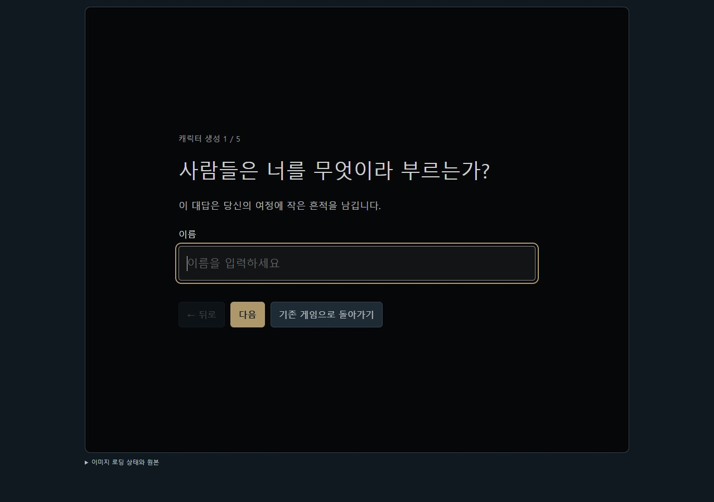
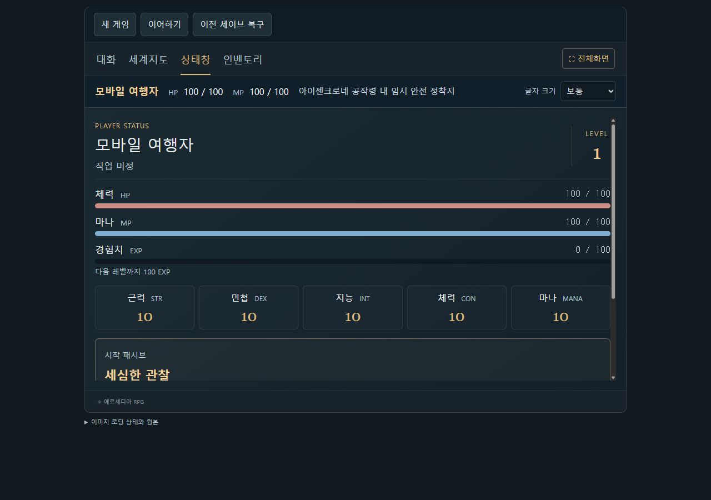
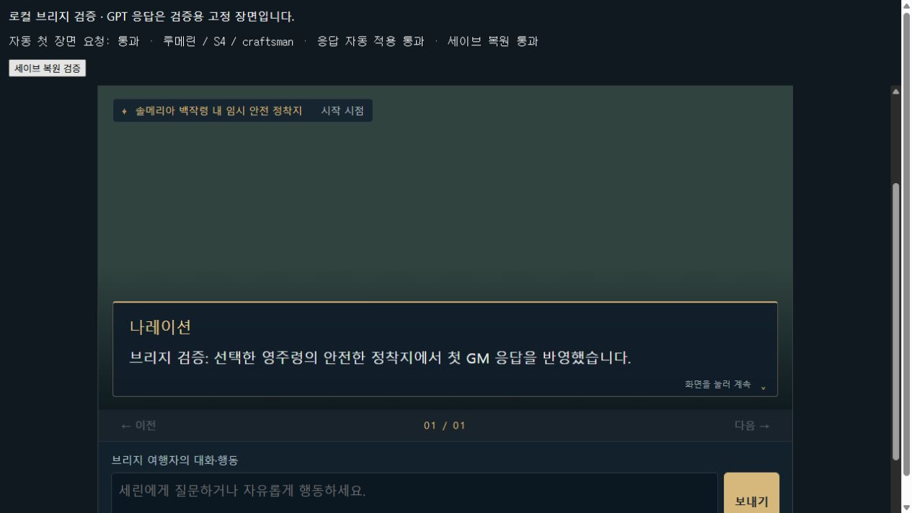

# 새 게임 UI 1.2.0 검증 (2026-10-08)

구현 기준: main의 `NEW_GAME_INTRO.md`, `characters/new_game_intro.json`, `characters/player_default.json`. 세계관 문서, 원화, 지도 좌표와 초기 템플릿 원본은 수정하지 않았다.

## 실행

- 기존 Tampermonkey 런처에서 최신 버전 확인 → 업데이트 적용 → 새 게임.
- 로컬 미리보기: `http://localhost:4173/?game=1`.
- 브리지 검증 화면: `http://localhost:4173/tests/new-game-host.html`. 이 화면은 GPT 응답을 고정된 검증용 장면으로 대체한다. 실제 게임 설치용 화면이 아니다.
- 빌드: `node tampermonkey/build.mjs`; 자동 검사: `node --test tests/*.test.mjs`.

## 실제 브라우저에서 확인한 결과

- 검은 VN 화면에서 이름 → 성별·모습 입력 또는 건너뛰기 → 삶 → 위험 대응 질문을 하나씩 표시.
- 수호+퇴로: 동률 후보 굳센 마음/길눈 중 길눈 직접 선택. 패시브 단계에서 새로고침해도 복원.
- 학문+관찰: 세심한 관찰 하나 확정. 수공업+도구: 손재주 하나 확정. 내용과 제한 표시.
- 벨로아 W3는 목록으로, 드라켄 E2는 지도 표식으로 선택. 표식/목록 선택 동기화 확인. 루메린 S4 목록 선택 확인. 시작 목록은 5/4/4이며 왕도·미개척지는 제외.
- 확정 전 이름/모습/답변/패시브/왕국/영주령/기본 능력치와 공개된 지역 정보를 확인.
- 확정 후 임시 안전 정착지에서 첫 장면 표시. 해당 지역 원화가 없으므로 배경과 NPC는 null. 다른 지역으로 세린을 이동시키지 않음.
- 상태창 Lv.1, 경험치 0/100, HP/MP 100/100, 근력/민첩/지능/체력/마나 능력치 10, 시작 패시브 표시 확인.
- 새로고침 → 이어하기에서 질문 재등장 없음. 새 게임 시작 → 취소하면 기존 인물과 장면 유지.
- 이전 세이브 복구에서 생성 전 기존 장면·이름 미정 상태로 복원됨을 확인.
- 390×844 모바일 크기에서 입력/질문/패시브/드라켄 지도 표식/확정/첫 장면 전체 진행. 가로 넘침 없음. 질문 상단 잘림을 수정하고 다시 확인.
- 배포용 `integration/game.html`을 런처와 같은 `sandbox="allow-scripts"` iframe에 로드. 첫 GM 요청이 자동 전달되고 선택 왕국/영주령/패시브를 포함함을 확인. 검증 응답의 reply_to 일치와 자동 장면 적용 확인. 런처와 동일한 정렬 비교 방식으로 생성 완료 세이브 복원 통과.

## 자동 검사

30개 검사 모두 통과.

16가지 답변 조합, 13개 허용 영주령, 초기 템플릿 분리, 기존 세이브의 선택 필드 미추가, 생성 중/완료 저장 복원, null 배경, 요청의 공개 패시브 제한, 이전 player 응답에 누락된 신규 능력치 유지와 기존 지도·인벤토리·장면 검사.

기존 검사의 두 기대값도 현재 동작에 맞췄다: 오래된 세이브에 선택 필드를 자동 추가하지 않고, 지도 카메라는 이미지 가장자리 밖으로 이동하지 않는다.

## 직접 확인하지 못한 범위

실물 휴대폰의 터치·화면 키보드 및 사용자의 실제 ChatGPT/Tampermonkey 환경에서 GPT가 새 첫 장면을 생성하는 과정은 직접 검증하지 않았다. 모바일 크기 브라우저 선택과 격리된 브리지 자동 요청/고정 응답 적용을 검증한 결과와 구분한다.

## 화면 기록

